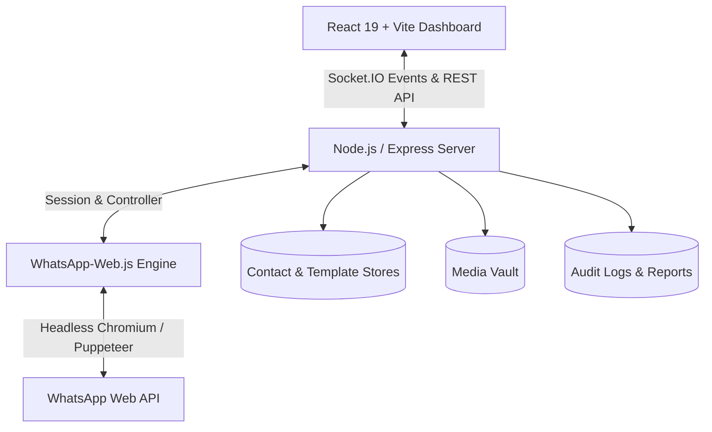

# 🌌 HALO: Human Automation and Lead Outreach

<div align="center">


**A hyper-efficient, secure, and human-like WhatsApp automation dashboard designed to orchestrate mass outreach campaigns while maintaining account safety through advanced neural activity simulation.**

[Key Features](#-key-features) • [Tech Stack](#-tech-stack) • [Installation & Quickstart](#-installation--quickstart) • [Architecture](#-architecture) • [Anti-Ban Safeguards](#-anti-ban--neural-simulation) • [Project Structure](#-project-structure) • [Author & License](#-author--license)

</div>

---

## 🌟 Overview

**HALO (Human Automation and Lead Outreach)** bridges high-volume communication with organic, human-like interaction patterns. Traditional bulk messaging tools trigger anti-spam heuristics due to robotic, predictable timing. HALO solves this with **neural activity simulation**—synthesizing variable typing rhythms, reading pauses, randomized batch delays, and adaptive media upload pacing to keep WhatsApp accounts safe while scaling personalized outreach.

---

## 🚀 Key Features

### 🧠 Neural Activity & Human Simulation
* **Human Typing Rhythm Simulation**: Replicates natural keystroke cadences and delays before dispatching messages.
* **Smart Reading & Jitter Delay**: Emulates organic human reading behavior and irregular intervals between contacts.
* **Account Warm-Up Mode**: Gradually increases daily outreach quotas (e.g., 20 $\rightarrow$ 50 $\rightarrow$ 100/day) for newly registered SIMs or fresh numbers.
* **Batch Throttle & Cooldown**: Automates batch pauses to prevent rate spikes and flag triggers.

### ⚡ Real-Time Reactive Command Center
* **Live QR Pairing via WebSockets**: Instant WhatsApp Web authentication directly in the browser via Socket.IO.
* **Interactive Campaign Orchestration**: Real-time controls to **Start**, **Pause**, **Resume**, or **Abort** running campaigns.
* **Live Terminal Audit Stream**: Real-time log monitor detailing every contact processed, delay elapsed, and message delivery status.

### 👥 Smart Lead & Contact Management
* **Multi-Format Ingestion**: Drag-and-drop support for **CSV** and **Excel (`.xlsx`, `.xls`)** contact files.
* **Dynamic Variable Extraction**: Automatically detects headers (`name`, `number`, `company`, etc.) for seamless tag personalization.
* **Group Organization**: Save and categorize contacts into distinct target audiences.
* **Progress Resumption**: Automatically tracks dispatched vs. pending contacts within each dataset.

### ✍️ Dynamic Template Studio & Live Phone Simulator
* **Dynamic Variable Tagging**: Use `{name}`, `{number}`, and custom placeholders within message templates.
* **WhatsApp Markdown Engine**: Supports `*bold*`, `_italic_`, `~strikethrough~`, and monospace formatting.
* **Interactive Phone Mockup**: Real-time smartphone simulator previewing exact message rendering and media layouts before launch.

### 📁 Media Vault & Asset Engine
* **Multi-Media Attachments**: Effortlessly broadcast PDF catalogs, brochures, flyers, images, and audio/video files.
* **Secure Local Storage**: Organized media repository with fast preview and one-click template attachment.

### 📊 Comprehensive Audit Reports & Analytics
* **Deliverability Metrics**: Track sent, pending, and failed deliveries with granular failure reason logging.
* **Lifetime Analytics**: Real-time counter of total campaigns executed and messages delivered.
* **Exportable Audit Logs**: One-click export of campaign reports to CSV for CRM syncing and performance analysis.

---

## 🛠️ Tech Stack

### Frontend
* **Core**: React 19 (JS / JSX), Vite
* **Styling**: Tailwind CSS v4, Lucide React Icons
* **Real-time & Utility**: Socket.IO Client, QRCode.react, Clsx

### Backend & Engine
* **Runtime**: Node.js, Express.js
* **Communication**: Socket.IO (Bidirectional WebSocket events)
* **Automation Engine**: `whatsapp-web.js` + Chromium / Puppeteer
* **Data Processing**: Multer, CSV-Parser, SheetJS (`xlsx`)

---

## 📐 Architecture



---

## 📦 Installation & Quickstart

### Prerequisites
* **Node.js** (v18.0.0 or higher recommended)
* **npm** or **yarn** / **pnpm**
* Google Chrome or Chromium installed on the host machine

### 1. Clone the Repository
```bash
git clone https://github.com/heyaryanmittal/HALO.git
cd HALO
```

### 2. Install Dependencies
```bash
npm install
```

### 3. Build the Production Bundle
```bash
npm run build
```

### 4. Launch HALO
```bash
npm start
```

Open your browser and navigate to **[http://localhost:3000](http://localhost:3000)**.

> **💡 Development Mode**: To run frontend hot-reloading with the backend concurrently:
> ```bash
> # Terminal 1: Backend Server
> npm start
> 
> # Terminal 2: Vite Dev Server
> npm run dev
> ```
> Dev server runs at `http://localhost:5173` with automatic API and WebSocket proxying.

---

## 📖 Step-by-Step Campaign Workflow

1. **Pair WhatsApp Account**: Open the dashboard at `http://localhost:3000` and click **Scan QR Code**. Scan the QR code using WhatsApp on your phone (**Linked Devices** $\rightarrow$ **Link a Device**).
2. **Import Contact Lists**: Navigate to the **Contacts** tab and upload your CSV or Excel list. Ensure a column named `number` or `phone` is present with international country codes (e.g. `919876543210`).
3. **Design Message Templates**: In the **Templates** tab, draft your personalized message. Insert dynamic variables like `{name}` and format using WhatsApp markdown syntax.
4. **Attach Media (Optional)**: Upload media files in the **Media Vault** and link them to your template.
5. **Configure Neural Simulation & Safety**: Go to the **Campaign Hub**, select your audience group and template, customize inter-message delays (recommended: 15s - 45s), enable human typing simulation, and optionally activate **Warm-Up Mode**.
6. **Launch & Monitor**: Click **Launch WhatsApp Campaign** and observe real-time execution in the live terminal monitor and analytics graph.

---

## 🛡️ Anti-Ban & Neural Simulation Best Practices

To safeguard your WhatsApp account and ensure maximum deliverability:
* **Recommended Latencies**: Set **Min Delay $\ge$ 15s** and **Max Delay $\ge$ 45s**.
* **Enable Human Simulation**: Keep typing simulation and reading pauses enabled to avoid static automation signatures.
* **Warm-Up New Numbers**: When deploying a new WhatsApp account, enable **Warm-Up Mode** to gradually scale volume over 7 to 14 days.
* **Personalize Every Message**: Use dynamic tags (`{name}`, `{company}`) so that outbound payloads are distinct.
* **Permission-Based Outreach**: Only send messages to opt-in leads and engaged contacts to prevent user-initiated blocks/reports.

---

## 📂 Project Structure

```
HALO/
├── app/                        # Backend Application (Node.js / Express)
│   ├── contacts/               # Uploaded contact datasets (.gitkeep)
│   ├── data/                   # Campaign progress, stats, and template JSON data
│   ├── media/                  # Media Vault attachments (.gitkeep)
│   ├── routes/                 # Express REST API route handlers
│   │   ├── api/                # Sub-routes (campaign, contacts, media, reports, templates)
│   │   └── index.js            # Unified API router
│   ├── utils/                  # Data parser utilities (CSV/Excel)
│   ├── whatsapp/               # WhatsApp Web client, sender & campaign manager
│   └── server.js               # Unified server entrypoint & WebSocket handler
├── src/                        # Frontend Application (React 19 + Vite)
│   ├── components/             # Reusable UI components (Navbar, QRModal, etc.)
│   ├── pages/                  # Dashboard, Contacts, Templates, Media, Reports
│   ├── services/               # Socket.IO client service
│   ├── App.jsx                 # Root React component & tab routing
│   ├── index.css               # Design system & Tailwind styling
│   └── main.jsx                # React DOM entry point
├── uploads/                    # Temporary upload staging (.gitkeep)
├── index.html                  # HTML entry point
├── package.json                # Project dependencies and npm scripts
├── vite.config.mjs             # Vite configuration with proxy rules
├── .gitignore                  # Git ignore rules for build, session & secrets
└── README.md                   # Project documentation
```

---

## 👤 Author & Repository

* **Author**: Aryan Mittal ([@heyaryanmittal](https://github.com/heyaryanmittal))
* **GitHub Repository**: [https://github.com/heyaryanmittal/HALO](https://github.com/heyaryanmittal/HALO)

---

## 📄 License

This project is licensed under the [MIT License](LICENSE).
